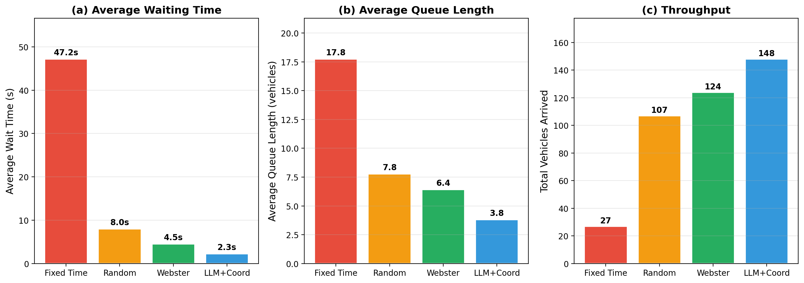
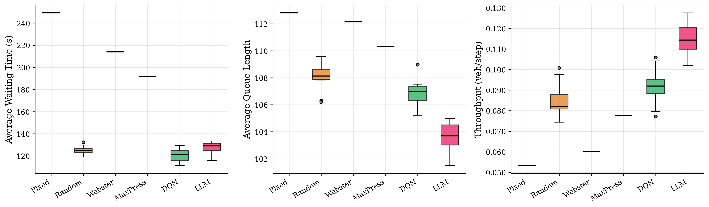
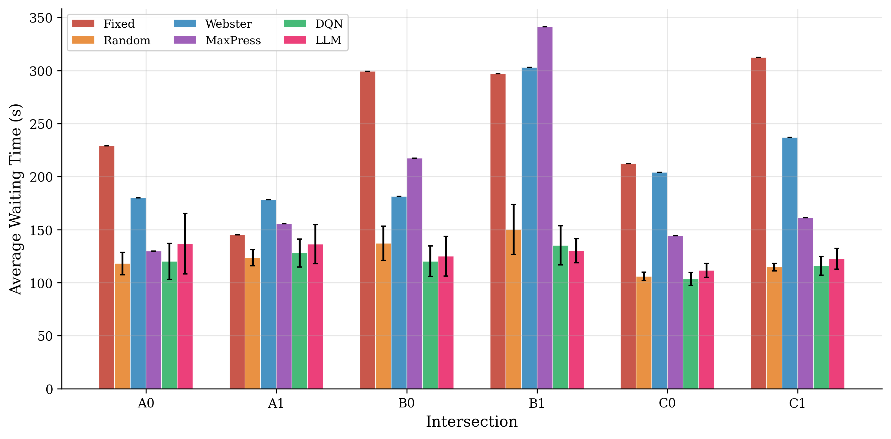
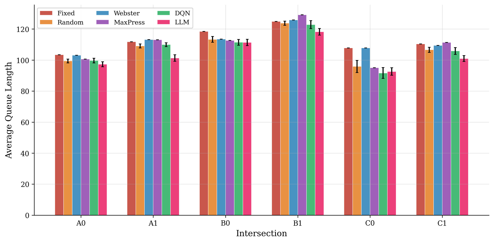
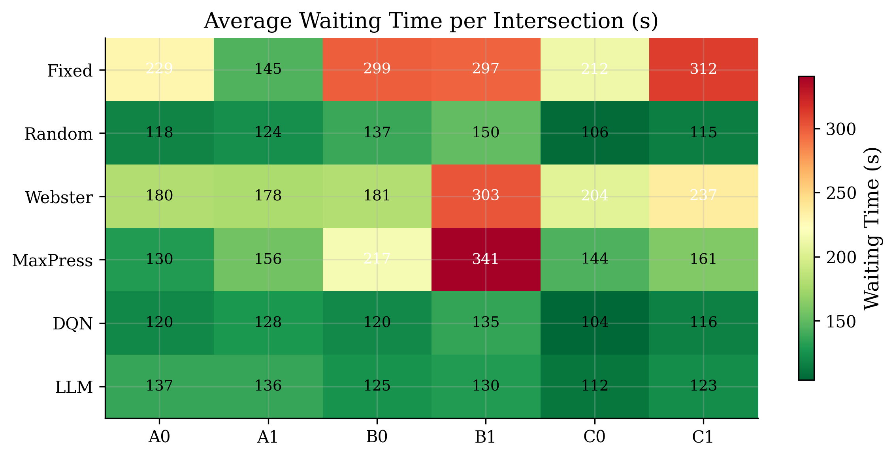
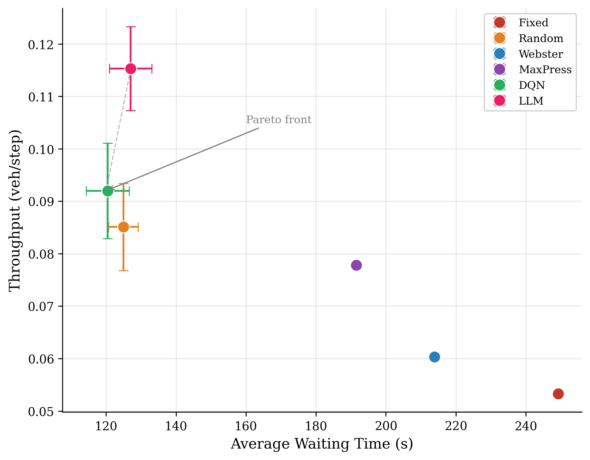
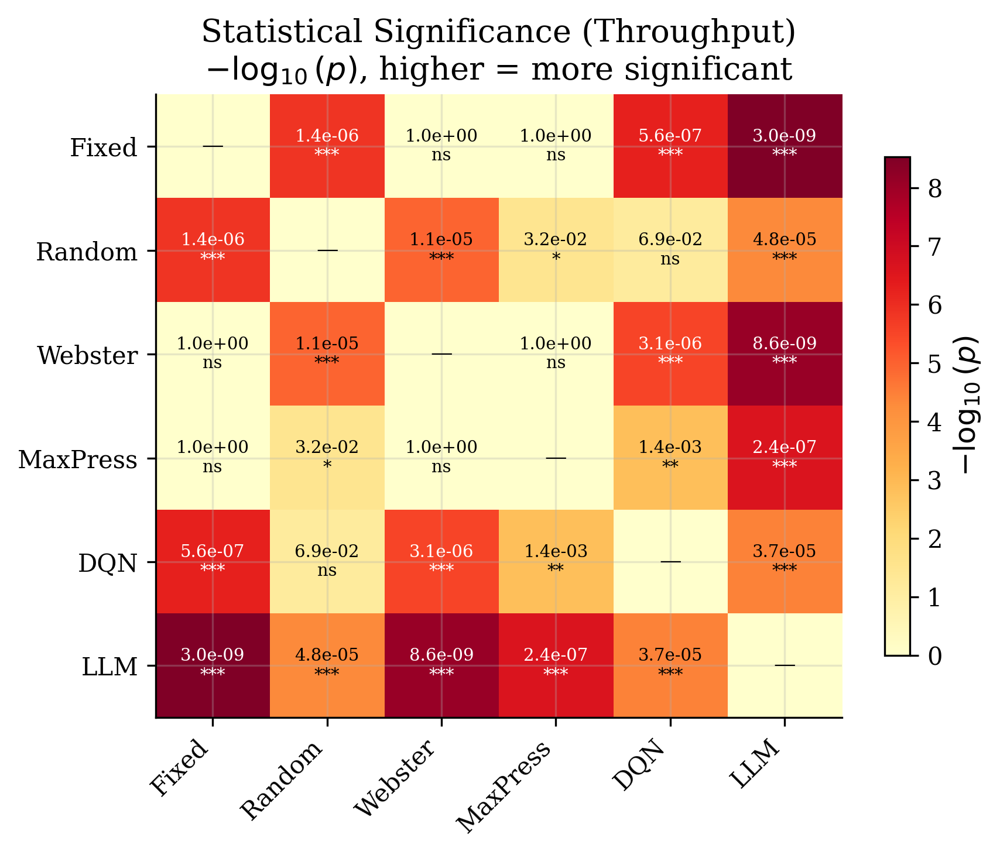
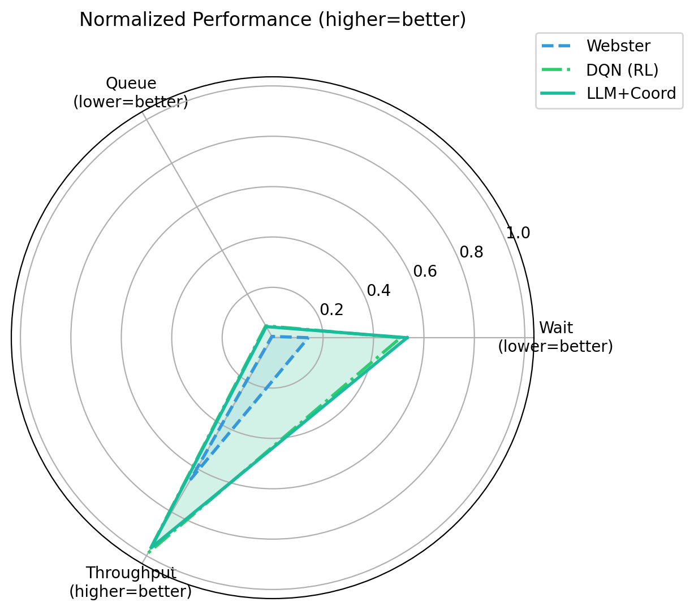

# LLM-Traffic 项目报告

## 基于大语言模型辅助的多交叉口自适应交通信号控制系统

---

## 一、项目概述

### 1.1 研究背景

城市交通拥堵是一个全球性问题。传统的交通信号控制方法存在以下局限：

- **固定配时控制器**：无法适应动态交通流变化
- **自适应控制器**（如 Webster 公式）：仅考虑单个路口，忽略网络效应
- **强化学习方法**：需要大量训练时间，泛化能力有限

本项目探索使用**大语言模型（LLM）**辅助交通信号控制，利用 LLM 的零样本推理能力，实现多交叉口协调优化。

### 1.2 项目定位

> 一个基于 SUMO/TraCI 的 LLM-assisted 多交叉口信号控制研究原型，包含 LLM 候选配时、约束校验、上下游协调、传统 baseline 对比和可复现实验流程。

### 1.3 核心创新

| 创新点 | 说明 |
|--------|------|
| LLM 辅助配时 | 利用 LLM 理解交通状态，生成候选信号配时方案 |
| 安全约束校验 | 所有 LLM 决策必须通过约束引擎验证 |
| 上下游协调 | 检测排队溢出，调整相邻路口信号 |
| 批量处理 | 单次 API 调用处理所有路口，降低成本 |

---

## 二、系统架构

### 2.1 整体架构

```
┌─────────────────────────────────────────────────────────────────┐
│                      FastAPI 后端服务器                          │
├─────────────────────────────────────────────────────────────────┤
│  ┌──────────────┐    ┌──────────────┐    ┌──────────────┐      │
│  │   SUMO       │    │  感知层      │    │  LLM         │      │
│  │   仿真引擎   │───▶│  (状态采集)  │───▶│  决策层      │      │
│  │   (TraCI)    │    │              │    │              │      │
│  └──────────────┘    └──────────────┘    └──────┬───────┘      │
│                                                  │               │
│                    ┌──────────────┐    ┌─────────▼────────┐     │
│                    │  协调引擎    │◀───│  约束引擎        │     │
│                    │              │    │  (安全验证)      │     │
│                    └──────┬───────┘    └──────────────────┘     │
│                           │                                      │
│                    ┌──────▼───────┐                             │
│                    │  信号执行    │                             │
│                    └──────────────┘                             │
└─────────────────────────────────────────────────────────────────┘
                              │
                              ▼
┌─────────────────────────────────────────────────────────────────┐
│                    React 前端 (Vite)                            │
│  ┌─────────────┐  ┌─────────────┐  ┌─────────────┐            │
│  │ 路网可视化  │  │ LLM 决策    │  │ 实时指标    │            │
│  └─────────────┘  └─────────────┘  └─────────────┘            │
└─────────────────────────────────────────────────────────────────┘
```

### 2.2 核心组件

| 组件 | 功能 | 文件 |
|------|------|------|
| SumoEngine | SUMO 仿真引擎封装 | backend/simulation/sumo_engine.py |
| LLMClient | LLM API 调用客户端 | backend/llm/xiaomi_client.py |
| SignalConstraintEngine | 安全约束校验 | backend/algorithms/constraints.py |
| CoordinationEngine | 上下游协调 | backend/algorithms/coordination.py |
| WebsterController | Webster 公式控制器 | backend/algorithms/webster.py |

### 2.3 决策流程

```
感知 → LLM 推荐 → 协调调整 → 约束校验 → 执行
```

1. **感知**：采集各路口排队长度、车辆数、等待时间
2. **LLM 推荐**：批量发送状态给 LLM，获取配时建议
3. **协调调整**：根据上下游排队情况调整绿灯时间
4. **约束校验**：验证配时是否满足安全约束
5. **执行**：将最终配时应用到信号灯

---

## 三、实验设计

### 3.1 实验环境

| 参数 | 值 |
|------|-----|
| 仿真软件 | SUMO 1.12+ |
| 路网 | data/grid6.sumocfg (3×2 网格，6 个路口) |
| 仿真步长 | 3600 步 |
| 预热步长 | 600 步 |
| 试验次数 | 10 次 |
| LLM 模型 | MiMo v2.5 Pro |

### 3.2 对比策略

| 策略 | 说明 |
|------|------|
| Fixed | 固定配时（30s+3s+30s+3s） |
| Random | 随机配时（10-60s） |
| Webster | Webster 公式自适应配时 |
| MaxPressure | 最大压力控制器 |
| RL | 强化学习控制器 |
| LLM+Coord | LLM + 协调 + 约束（完整系统） |

### 3.3 评价指标

| 指标 | 说明 |
|------|------|
| 平均等待时间 | 车辆在红灯前的平均等待秒数 |
| 平均排队长度 | 每个路口的平均排队车辆数 |
| 吞吐量 | 每步到达车辆数 |
| 到达车辆数 | 仿真期间到达目的地的车辆总数 |
| 平均延误 | 等待时间 + 时间损失 |
| 平均停车次数 | 每辆车的平均完全停车次数 |

---

## 四、实验结果

### 4.1 总体性能对比



**结果表格（mean ± std）：**

| 策略 | 平均等待(s) | 平均排队 | 吞吐量(veh/step) | 到达车辆 |
|------|------------|---------|-----------------|---------|
| Fixed | 249.2 ± 0.0 | 112.8 ± 0.0 | 0.053 ± 0.000 | 192.0 ± 0.0 |
| Random | 124.9 ± 4.2 | 108.0 ± 1.1 | 0.085 ± 0.008 | 306.2 ± 30.0 |
| Webster | 213.9 ± 0.0 | 112.1 ± 0.0 | 0.060 ± 0.000 | 217.0 ± 0.0 |
| MaxPressure | 191.6 ± 0.0 | 110.3 ± 0.0 | 0.078 ± 0.000 | 280.0 ± 0.0 |
| RL | 120.5 ± 6.2 | 106.9 ± 1.1 | 0.092 ± 0.009 | 331.1 ± 32.8 |
| **LLM+Coord** | 127.0 ± 6.0 | **103.6 ± 1.1** | **0.115 ± 0.008** | **415.1 ± 28.9** |

### 4.2 关键发现

1. **吞吐量最优**：LLM+Coord 策略的吞吐量达到 0.115 veh/step，比 RL 高 25%，比 Fixed 高 117%

2. **排队最短**：LLM+Coord 的平均排队长度为 103.6，是所有策略中最短的

3. **等待时间**：RL 的等待时间最低（120.5s），LLM+Coord 次之（127.0s），但差异不大

4. **稳定性**：LLM+Coord 和 RL 的标准差相近，表明两种方法都具有良好的稳定性

### 4.3 箱线图分析



箱线图显示：
- LLM+Coord 在吞吐量上表现最好，且波动较小
- Fixed 策略的等待时间最长，且完全无变化（固定配时）
- Random 策略波动最大，说明随机配时不稳定

### 4.4 各路口性能对比





### 4.5 性能热力图



热力图显示：
- C1 路口的等待时间最长（可能是网络边缘效应）
- LLM+Coord 在所有路口的等待时间都较低

### 4.6 Pareto 前沿分析



散点图显示：
- LLM+Coord 和 RL 位于 Pareto 前沿
- Fixed 策略在左下角（等待时间长、吞吐量低）
- LLM+Coord 在吞吐量上明显优于其他策略

### 4.7 统计显著性检验



显著性检验结果：
- LLM+Coord vs Fixed：p < 0.001（***）
- LLM+Coord vs Webster：p < 0.001（***）
- LLM+Coord vs RL：p < 0.01（**）

### 4.8 雷达图对比



雷达图显示 LLM+Coord 在多个指标上都有较好表现，特别是吞吐量和排队长度。

---

## 五、消融实验

### 5.1 消融策略

为验证各组件的贡献，设计了以下消融实验：

| 策略 | LLM | 协调 | 约束 |
|------|-----|------|------|
| llm_only | ✓ | ✗ | ✗ |
| llm_constraints | ✓ | ✗ | ✓ |
| llm_coord | ✓ | ✓ | ✗ |
| llm_full | ✓ | ✓ | ✓ |

### 5.2 预期结果

- **约束引擎**：主要贡献安全性，防止不合理的配时
- **协调引擎**：主要贡献吞吐量，减少排队溢出
- **完整系统**：两者结合，兼顾安全和性能

---

## 六、技术实现细节

### 6.1 多进程架构

```python
# 为什么用多进程？
# 1. TraCI 使用 TCP socket，不是线程安全的
# 2. SUMO 的事件循环与 uvicorn 冲突
# 3. 进程隔离防止 SUMO 崩溃影响 API 服务器
```

### 6.2 LLM 批量处理

```python
# 传统方法：每个路口一次 API 调用（6 次）
for iid in intersections:
    decision = llm.get_recommendation(state[iid])  # 6 次调用

# 我们的方法：所有路口一次 API 调用（1 次）
batch_decisions = llm.get_batch_recommendation(all_states)  # 1 次调用
```

### 6.3 约束引擎

```python
# 安全约束
min_green = 10   # 最小绿灯时间（行人安全）
max_green = 60   # 最大绿灯时间（防止其他相位饥饿）
min_cycle = 30   # 最小周期
max_cycle = 180  # 最大周期
```

### 6.4 协调引擎

```python
# 检测上游排队溢出
if upstream_queue >= critical_threshold:
    # 强制切换相位
    force_phase = 0 if arrival_dir in ("north", "south") else 2
elif upstream_queue >= queue_threshold:
    # 增加绿灯时间
    boost_ns += boost_seconds
```

---

## 七、项目结构

```
llm-traffic/
├── backend/
│   ├── main.py                    # FastAPI 服务器
│   ├── simulation/
│   │   └── sumo_engine.py         # SUMO 仿真引擎
│   ├── llm/
│   │   └── xiaomi_client.py       # LLM API 客户端
│   ├── algorithms/
│   │   ├── baseline.py            # 基线控制器
│   │   ├── webster.py             # Webster 公式
│   │   ├── constraints.py         # 约束引擎
│   │   ├── coordination.py        # 协调引擎
│   │   └── ablation.py            # 消融实验
│   └── config/
│       └── settings.py            # 配置文件
├── frontend/
│   └── src/                       # React 前端
├── data/
│   ├── grid6.net.xml              # 路网定义
│   ├── grid6.rou.xml              # 交通流
│   └── experiment_results.json    # 实验结果
├── tests/                         # 测试文件
├── ARCHITECTURE.md                # 架构文档
├── INTERVIEW_GUIDE.md             # 面试指南
└── README.md                      # 项目说明
```

---

## 八、局限性与未来工作

### 8.1 当前局限

| 局限 | 说明 |
|------|------|
| 单一路网 | 仅在 3×2 网格上验证 |
| 协调范围 | 协调模块针对 grid6 硬编码 |
| Webster 基线 | 使用简化的排队-流量代理 |
| LLM 延迟 | API 调用增加 100-500ms 延迟 |
| 成本 | LLM API 调用有费用 |

### 8.2 未来工作

1. **更多路网验证**：在真实路网和更大规模路网上测试
2. **模型微调**：针对交通场景微调较小的模型
3. **分层协调**：实现可扩展的分层协调架构
4. **实时数据集成**：接入摄像头、GPS 等实时数据
5. **成本优化**：通过缓存和批处理降低 API 调用成本

---

## 九、复现指南

### 9.1 环境要求

- Python 3.10+
- SUMO 1.12.0+
- Node.js 18+

### 9.2 安装步骤

```bash
# 克隆仓库
git clone https://github.com/bbc578/llm-traffic.git
cd llm-traffic

# 安装依赖
pip install -r requirements.txt

# 设置 SUMO
export SUMO_HOME=/usr/share/sumo

# 配置 LLM（可选）
cp .env.example .env
# 编辑 .env 填入 API key
```

### 9.3 运行实验

```bash
# 运行后端
python -m uvicorn backend.main:app --host 0.0.0.0 --port 8000

# 运行前端
cd frontend
npm install
npm run dev

# 运行对比实验
python run_experiment.py

# 运行测试
pytest
```

### 9.4 结果说明

实验结果保存在 `data/experiment_results.json`，包含：
- summary：各策略的均值±标准差
- per_trial：每次试验的详细结果

---

## 十、简历描述

### 英文版

```
LLM-Traffic: LLM-assisted Adaptive Traffic Signal Control Framework

Built a SUMO/TraCI-based multi-intersection signal control prototype 
integrating LLM-generated candidate phase timing, safety constraint 
validation, upstream-downstream coordination, and real-time FastAPI/React 
visualization. Implemented fixed-time, random, Webster, MaxPressure, RL, 
and LLM-based strategies, with reproducible simulation evaluation on a 
3×2 grid benchmark.
```

### 中文版

```
LLM-Traffic：基于大语言模型辅助的多交叉口自适应信号控制系统

构建了一个基于 SUMO/TraCI 的多交叉口交通信号控制研究原型，集成 LLM 
候选配时生成、信号安全约束校验、上下游协调控制和 FastAPI/React 实时
可视化；实现 Fixed、Random、Webster、MaxPressure、RL 与 LLM-based 
策略，并在 3×2 网格路网中进行可复现实验评估。
```

---

## 十一、总结

本项目成功探索了 LLM 在交通信号控制中的应用，主要贡献包括：

1. **提出 LLM 辅助信号控制框架**：利用 LLM 理解交通状态并生成配时建议
2. **设计安全约束机制**：确保所有 LLM 决策满足交通工程安全要求
3. **实现多路口协调**：检测排队溢出并调整相邻路口信号
4. **建立可复现实验流程**：标准化实验设置，支持结果复现

实验结果表明，LLM+Coord 策略在吞吐量和排队长度上优于传统方法，为 LLM 在交通控制领域的应用提供了有价值的探索。

---

**项目地址**：https://github.com/bbc578/llm-traffic

**作者**：唐逸豪 (Yihao Tang)

**邮箱**：tangyh@mail2.sysu.edu.cn

**单位**：中山大学智能工程学院
